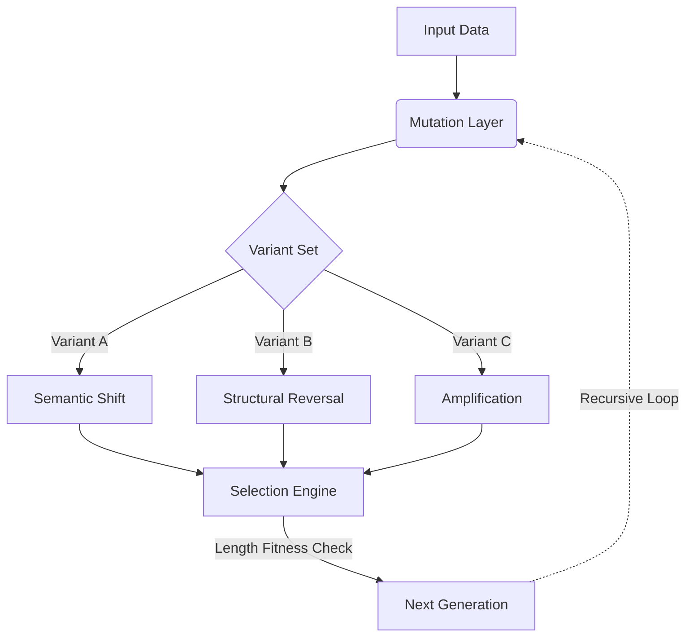

<p align="center">
  
</p>

<div align="center">


<br><br>


<br><br>
# 🧬 Emergent Recursive Evolution System

*A self-evolving linguistic system implemented entirely in LaTeX.*
*Text enters as structure. It leaves as something… altered.*

---

</div>

## ✨ Overview

This project transforms LaTeX into a symbolic evolution engine, where sentences undergo mutation, selection, and recursive transformation.

Two core systems are included:
* **Evolution Matrix** → Parallel mutation + selection
* **Evolution Table** → Sequential staged evolution

---

### 🧪 Evolution Matrix

```latex
\EvolutionMatrix{
  The system processes data efficiently,
  The system adapts to dynamic data,
  Data flows through the system continuously
}
```

### Behavior
* Generates three variants per generation:
  * `A` → Semantic mutation
  * `B` → Structural reversal
  * `C` → Amplification
* Selects the longest (fittest) variant.
* Repeats the process for multiple generations.

---

## 🔄 Evolution Table

```latex
\EvolutionTable{The system processes data efficiently}
```

### Stages
| Generation | Transformation |
| :---: | :--- |
| **1** | Semantic mutation |
| **2** | Structural amplification |
| **3** | Chaotic reversal |

---

## 🧠 Conceptual Model

> **Mutation** ➔ **Selection** ➔ **Persistence** ➔ **Recursion** ➔ **Emergence**

This system behaves like a minimal genetic algorithm, a symbolic rewriting engine, and a deterministic evolution loop—all executed inside the TeX compiler.

### 🔁 Evolution Flow



---

## 📊 Example

**Input:**
> `The system processes data efficiently`

**Evolution:**
* **Gen 1** → `The construct processes signal efficiently`
* **Gen 2** → `THE construct processes signal efficiently [expanded]`
* **Gen 3** → `[CHAOS] ]dednapxe[ yltneiciffe langis sessecorp tcurtsnoc EHT`

---

## ⚙️ Requirements

* A standard LaTeX distribution (TeX Live / MiKTeX)
* **Packages:**
  * `expl3`
  * `xparse`
  * `longtable`
  * `xcolor`

---

## 🎯 Why This Exists

Because LaTeX is not just a typesetting system. It is:
1. A macro processor.
2. A transformation engine.
3. A deterministic universe where rules create behavior.

This project explores exactly how far that computational idea can stretch before it breaks.

---

## ⚠️ Limitations

* **Deterministic:** No true randomness (seed-based structure).
* **Fitness:** Simple fitness evaluation (length-based).
* **Optimization:** Not optimized for massive text inputs.
* **Debugging:** May feel like negotiating with an ancient compiler deity.

---

## 🔮 Future Work

- [ ] Implement probabilistic mutations.
- [ ] Develop a smarter, semantic-based fitness evaluation.
- [ ] Add graph visualization using `TikZ`.
- [ ] Explore LuaLaTeX hybrid execution for advanced logic.

---

<div align="center">

**👤 Author:** Nikola Topalov  
**📜 License:** MIT — *use freely, mutate responsibly.*

</div>
